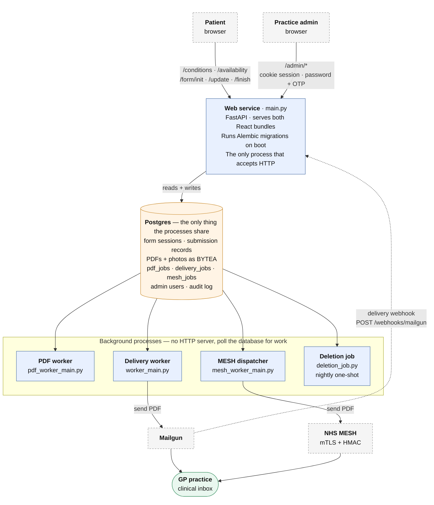
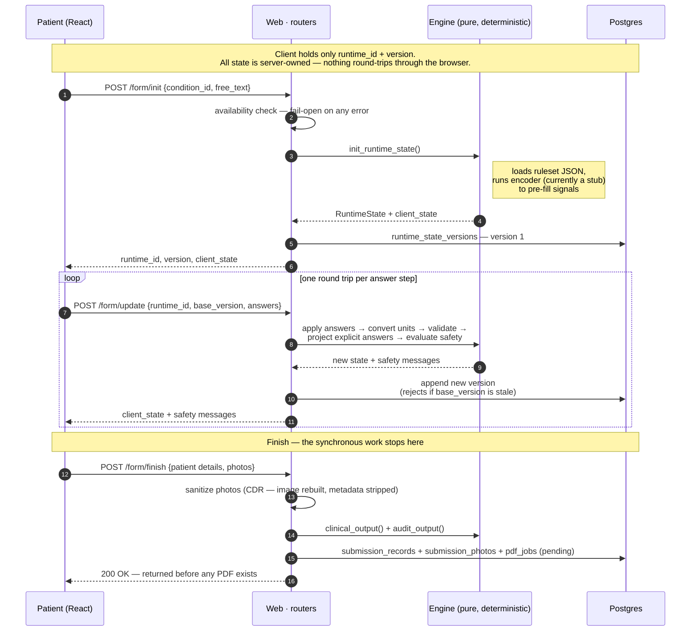

# Econsult — System Diagrams (DRAFT)

Status: **draft for discussion**. Not yet a maintained artefact. Nothing else in the
documentation set links to it yet.

These diagrams are written in [Mermaid](https://mermaid.js.org/), a text format that
GitHub renders as pictures automatically. The source is plain text, so it diffs and
reviews like code — when the architecture changes, the diagram changes in the same
commit.

---

## How to read this file

There are two diagrams here, deliberately at **different zoom levels**:

| Diagram | Question it answers | When you'd look at it |
| --- | --- | --- |
| 1. Deployment view | *What separate things are running, and what do they talk to?* | Onboarding, deployment, "why is nothing being sent?" |
| 2. Submission flow | *What actually happens when a patient submits a form?* | Debugging a stuck submission, planning changes to delivery |

The single most common mistake with architecture diagrams is putting everything on
one canvas. A diagram that shows all 60 modules is a picture of a hairball and tells
you nothing. Each diagram should answer **one question**, and anything that doesn't
help answer it gets left out.

---

## Diagram 1 — Deployment view

*What separate processes exist, what data store do they share, and what outside
systems do they reach?*

Deliberately excluded: individual Python modules, the engine's internals, table
schemas. Those belong to a lower zoom level.

Reading note: arrows point **the way work flows**, not the way bytes travel. The
workers poll and claim from Postgres — the arrow from the database down to them means
"work reaches this process from here", not that the database calls out.

All five processes ship in **one Docker image** and run as separate Railway services,
selected by their start command. Sentry receives errors from all four long-running
processes; that's left off the diagram deliberately — it connects to everything and
would obscure the shape without telling you anything you didn't already assume.

**Things this diagram is meant to make obvious:**

- The four long-running processes **share nothing but the database**. There is no
  message broker, no queue server, no shared memory. The "queues" are Postgres tables
  that workers poll and claim. That is a real design decision with real consequences
  (simple to operate; polling latency; every handoff is transactional).
- The web service is the **only** process that speaks HTTP inbound. The workers have
  no HTTP server at all — you cannot health-check them over the network.
- Only the web service runs migrations. Workers assume the schema already exists and
  crash-restart until it does.
- PDFs and patient photos live **in Postgres as BYTEA**, not in object storage. That
  is unusual and worth being conscious of as volume grows.

---

## Diagram 2 — Submission flow

*What happens from "patient starts a form" to "PDF lands with the GP practice"?*

This is the same system at a lower zoom level, following one journey through it.
Split into two parts, because the interesting thing about this system is **where the
synchronous request ends and the asynchronous pipeline begins**.

### 2a — The synchronous part (patient is waiting)

### 2b — The asynchronous part (patient has gone home)

**Things this diagram is meant to make obvious:**

- There are **three queues in a chain**, not one: `pdf_jobs` → (`delivery_jobs` |
  `mesh_jobs`). Each stage claims, works, and marks. A submission can be stuck at any
  of the three, which is exactly the question you'll be asking when one goes missing.
- The email/MESH choice is **not per-submission**. It's an environment variable read
  once when the PDF worker boots, which picks the enqueuer implementation. Flipping it
  requires a worker restart.
- The fallback is **one-directional**: MESH can fall back to email, email never falls
  back to MESH.
- The ordering in the fallback box is a deliberate safety invariant. Marking the mesh
  job first means a crash mid-fallback leaves the submission *undelivered but
  detectable*, never *sent twice on both channels*. A recovery sweep repairs it.

---

## Open questions for the draft review

1. **Zoom level.** Is diagram 1 at the right altitude, or would a version showing the
   `router → service → repository` layering inside the web service be more useful for
   the work you actually do?
2. **Coverage.** These two skip the admin portal entirely (auth, MFA, availability
   config, audit log). Worth a third diagram, or is that better as prose?
3. **Maintenance.** A diagram nobody updates is worse than no diagram — it actively
   misleads. Options: (a) keep it deliberately coarse so it changes rarely, (b) commit
   to updating it whenever a process or queue is added, (c) treat it as a one-off
   onboarding artefact and date-stamp it as such. I'd suggest (a).

## Known simplifications in this draft

- The encoder is drawn as part of `init_runtime_state`. Today it is
  `encoder_stub.py` — a placeholder, not a real model.
- Retry/backoff exists at every worker stage and is not drawn; only the terminal
  fallback path is shown.
- The `mesh_jobs` lifecycle has six states; the diagram shows the two transitions
  that change where the PDF ends up.
- Rate limiting, request-size limits and the Sentry wiring exist on the request path
  and are omitted from diagram 2 to keep the journey readable.
