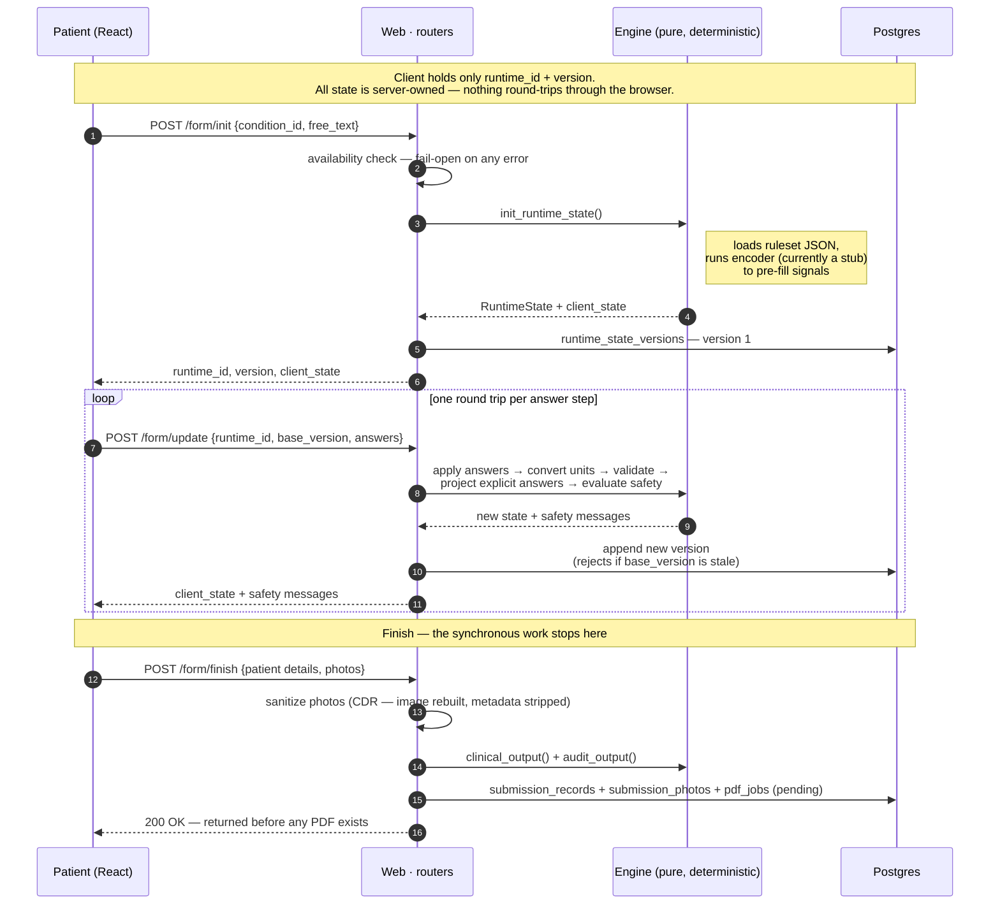
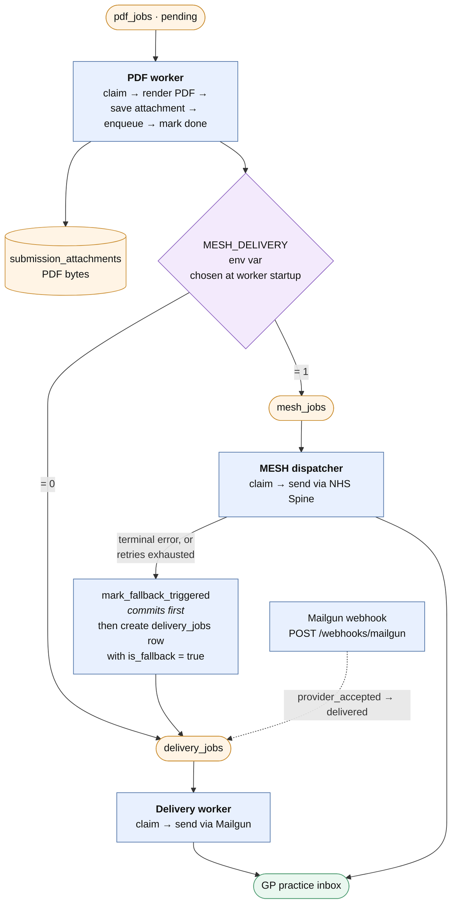
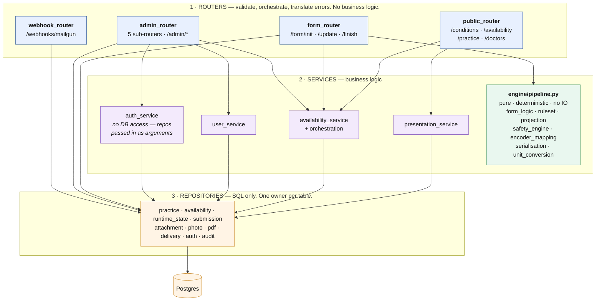
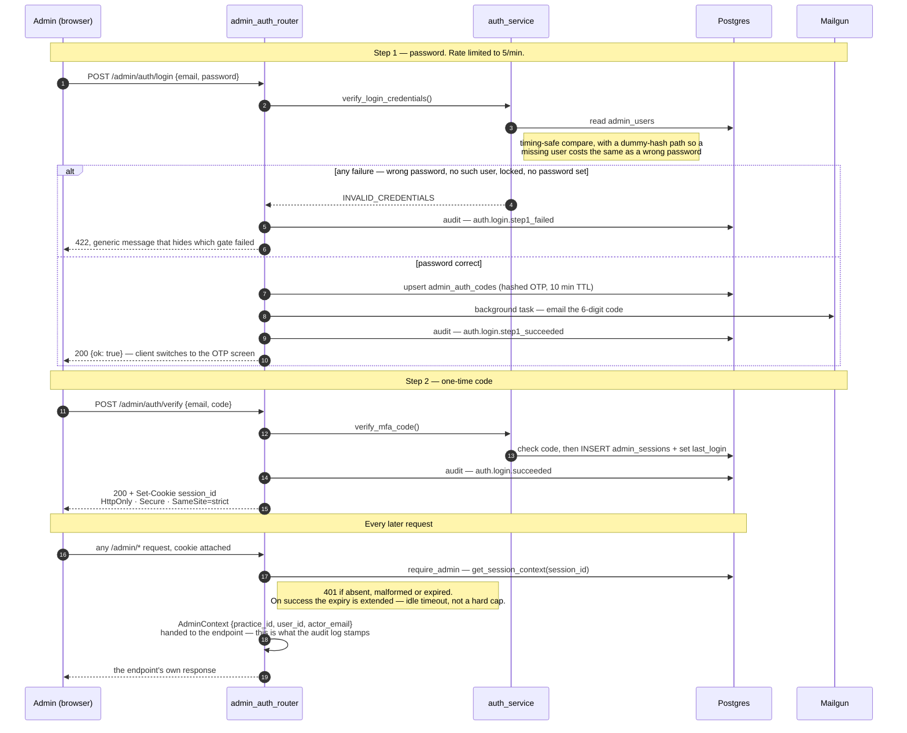
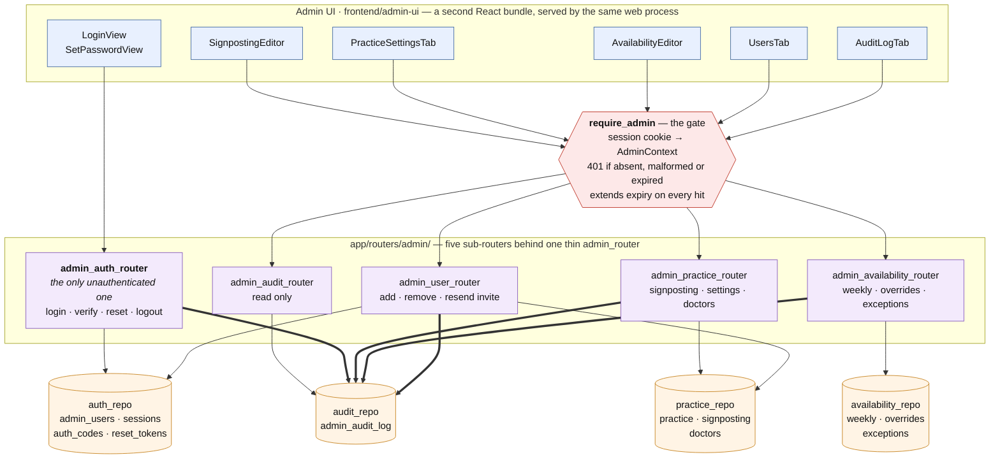

# Econsult — System Diagrams (DRAFT)

Status: **draft for discussion**. Not yet a maintained artefact. Nothing else in the
documentation set links to it yet.

These diagrams are written in [Mermaid](https://mermaid.js.org/), a text format that
GitHub renders as pictures automatically. The source is plain text, so it diffs and
reviews like code — when the architecture changes, the diagram changes in the same
commit.

---

## How to read this file

There are two diagrams here, deliberately at **different zoom levels**:

| Diagram | Question it answers | When you'd look at it |
| --- | --- | --- |
| 1. Deployment view | *What separate things are running, and what do they talk to?* | Onboarding, deployment, "why is nothing being sent?" |
| 2. Submission flow | *What actually happens when a patient submits a form?* | Debugging a stuck submission, planning changes to delivery |
| 3. Layering | *Where does a given piece of code belong?* | Adding a feature, reviewing a PR, settling "should this go in the router?" |
| 4. Admin portal | *How does an admin log in, and what can they reach?* | Auth changes, adding an admin screen, audit/compliance questions |

Diagrams 1 and 2 are about **runtime** — what happens while the system is running.
Diagrams 3 and 4 are about **code structure** — where things live. They're different
kinds of map and it's worth not mixing them on one canvas.

The single most common mistake with architecture diagrams is putting everything on
one canvas. A diagram that shows all 60 modules is a picture of a hairball and tells
you nothing. Each diagram should answer **one question**, and anything that doesn't
help answer it gets left out.

---

## Diagram 1 — Deployment view

*What separate processes exist, what data store do they share, and what outside
systems do they reach?*

Deliberately excluded: individual Python modules, the engine's internals, table
schemas. Those belong to a lower zoom level.

Reading note: arrows point **the way work flows**, not the way bytes travel. The
workers poll and claim from Postgres — the arrow from the database down to them means
"work reaches this process from here", not that the database calls out.

All five processes ship in **one Docker image** and run as separate Railway services,
selected by their start command. Sentry receives errors from all four long-running
processes; that's left off the diagram deliberately — it connects to everything and
would obscure the shape without telling you anything you didn't already assume.

**Things this diagram is meant to make obvious:**

- The four long-running processes **share nothing but the database**. There is no
  message broker, no queue server, no shared memory. The "queues" are Postgres tables
  that workers poll and claim. That is a real design decision with real consequences
  (simple to operate; polling latency; every handoff is transactional).
- The web service is the **only** process that speaks HTTP inbound. The workers have
  no HTTP server at all — you cannot health-check them over the network.
- Only the web service runs migrations. Workers assume the schema already exists and
  crash-restart until it does.
- PDFs and patient photos live **in Postgres as BYTEA**, not in object storage. That
  is unusual and worth being conscious of as volume grows.

---

## Diagram 2 — Submission flow

*What happens from "patient starts a form" to "PDF lands with the GP practice"?*

This is the same system at a lower zoom level, following one journey through it.
Split into two parts, because the interesting thing about this system is **where the
synchronous request ends and the asynchronous pipeline begins**.

### 2a — The synchronous part (patient is waiting)

### 2b — The asynchronous part (patient has gone home)

**Things this diagram is meant to make obvious:**

- There are **three queues in a chain**, not one: `pdf_jobs` → (`delivery_jobs` |
  `mesh_jobs`). Each stage claims, works, and marks. A submission can be stuck at any
  of the three, which is exactly the question you'll be asking when one goes missing.
- The email/MESH choice is **not per-submission**. It's an environment variable read
  once when the PDF worker boots, which picks the enqueuer implementation. Flipping it
  requires a worker restart.
- The fallback is **one-directional**: MESH can fall back to email, email never falls
  back to MESH.
- The ordering in the fallback box is a deliberate safety invariant. Marking the mesh
  job first means a crash mid-fallback leaves the submission *undelivered but
  detectable*, never *sent twice on both channels*. A recovery sweep repairs it.

---

## Diagram 3 — Layering inside the web service

*When I add a piece of code, where does it belong?*

This is a **structure** map, not a runtime map. Nothing here happens in time order —
it shows which module is allowed to call which. Only the web service is drawn; the
workers have their own, much shorter chain.

**Things this diagram is meant to make obvious:**

- **The engine is the unusual layer.** It sits at service level but touches no
  database and performs no IO — the same inputs always give the same outputs. That is
  what makes the clinical logic testable without a database, and it is the reason
  `file_structure.md` carries a list of banned imports protecting it.
- **`auth_service` has no database access at all.** Repositories are passed to it as
  arguments. Its arrow to the repository band is drawn for completeness, but the
  dependency runs the other way round to everything else on the diagram.
- **Several routers reach straight past the service layer to a repository.** That's
  the crossing lines from `form_router` and `admin_router` down to band 3, and it is
  accurate, not a drawing error. The service layer is only populated where there was
  real logic to hold; simple reads and writes go direct. Worth being conscious of —
  "we have three layers" is true in places and aspirational in others.
- **Objects are not imported, they're injected.** `wiring.py` builds every repository
  and service exactly once at startup and puts them on `app.state`; routers receive
  them through `Depends(get_*)`. That's left off the canvas deliberately — it applies
  to every arrow in band 1, so drawing it would add lines everywhere and shape
  nowhere.

---

## Diagram 4 — Admin portal

Two views again, for the same reason as diagram 2: one runtime, one structural.

### 4a — Login (runtime)

**Things this diagram is meant to make obvious:**

- **Two independent factors.** Password and one-time code are separate round trips.
  Passing step 1 gets you no session — only step 2 issues the cookie.
- **The failure branch is deliberately uninformative.** Every step-1 failure returns
  the same 422 regardless of cause, so an attacker cannot use the response to discover
  which email addresses are registered. The failure *is* recorded in the audit log —
  just not disclosed to the caller.
- **The OTP email is sent as a background task.** The response doesn't wait for
  Mailgun. That's not only speed: making the caller wait would reintroduce a timing
  difference between "user exists" and "user doesn't", undoing the point above.
- **The session is an idle timeout, not a fixed lifetime.** Every authenticated
  request extends it.

### 4b — What an authenticated admin can reach (structure)

Thick arrows are audit writes.

**Things this diagram is meant to make obvious:**

- **One gate, and exactly one router outside it.** `admin_auth_router` is
  unauthenticated by necessity — you can't require a session to log in. Everything
  else goes through `require_admin`. That makes the auth router the piece to look at
  hardest in review.
- **Every mutating router writes to the audit log.** The thick arrows all converge on
  one table. Audit is a cross-cutting obligation, not a feature of one screen.
- **The admin UI is a separate React bundle** from the patient app, but served by the
  same web process — so it is not separately deployable, and shares the same origin.
- **The admin surface only reaches four repositories.** No admin route touches
  submissions, PDFs, photos or the delivery queues. Admins configure the practice;
  they do not read patient data through this portal.

---

## Open questions for the draft review

1. **Which of these four earn their keep?** They cost more to maintain than they look.
   My guess at the ranking by value-per-line-of-maintenance: 2 (submission flow) > 1
   (deployment) > 4 (admin) > 3 (layering). Diagram 3 is the one most likely to drift,
   because module structure changes far more often than process topology.
2. **Diagram 3's honesty problem.** It shows routers reaching past the service layer.
   That's accurate today. If that's a pattern you want to move away from, the diagram
   is a useful record of the current state; if it's fine, the "3 layers" framing may be
   overselling what's actually a 2-layer system with some services in it.
3. **Maintenance.** A diagram nobody updates is worse than no diagram — it actively
   misleads. Options: (a) keep them deliberately coarse so they change rarely, (b)
   commit to updating whenever a process or queue is added, (c) treat them as one-off
   onboarding artefacts and date-stamp them. I'd suggest (a) for 1 and 2, and either
   dropping 3 or accepting it will need a refresh every few months.

## Known simplifications in this draft

- The encoder is drawn as part of `init_runtime_state`. Today it is
  `encoder_stub.py` — a placeholder, not a real model.
- Retry/backoff exists at every worker stage and is not drawn; only the terminal
  fallback path is shown.
- The `mesh_jobs` lifecycle has six states; the diagram shows the two transitions
  that change where the PDF ends up.
- Rate limiting, request-size limits and the Sentry wiring exist on the request path
  and are omitted from diagram 2 to keep the journey readable.
- Diagram 3 collapses all ten repositories into one box. They are separate classes
  with one table owner each — drawing them individually would triple the arrows
  without changing the shape.
- Diagram 3 covers the web service only. The workers have their own chain
  (`worker loop → repositories → Postgres`) with no router or service layer at all.
- Diagram 4a omits the password-reset and set-password flows, which share the
  invitation-token path used when an admin is first added.
